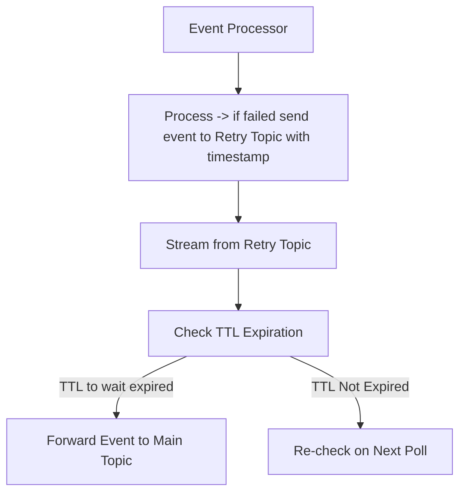

Event Stream
----------------------

```
./gradlew bootRun
```



```mermaid
graph TD

    A[Event Processor] --> B[Process -> if failed send event to Retry Topic with timestamp]
    B --> C[Stream from Retry Topic]
    C --> D[Check TTL Expiration]
    D --> |TTL to wait expired| E[Forward Event to Main Topic]
    D --> |TTL Not Expired| F[Re-check on Next Poll]
```